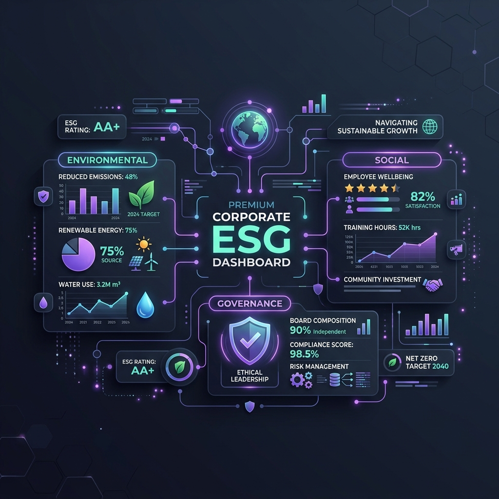

<div align="center">



# ?? EcoSphere ESG Management Platform

**Enterprise-grade ESG Intelligence & Governance Command Center**

[](https://djangoproject.com)
[](https://python.org)
[](https://docker.com)
[](https://django-rest-framework.org)
[](LICENSE)

> *"Monitor, measure and improve Environmental, Social and Governance performance across your entire organization from a single unified platform."*

[Live Demo](#) · [Documentation](#) · [Report Bug](#) · [Request Feature](#)

</div>

---

## ?? Table of Contents

- [Overview](#-overview)
- [Screenshots](#-screenshots)
- [Architecture](#-architecture--workflow)
- [Features](#-features)
- [Tech Stack](#-tech-stack)
- [Project Structure](#-project-structure)
- [Quick Start](#-quick-start)
- [Docker Deployment](#-docker-deployment)
- [API Reference](#-api-reference)
- [Environment Variables](#-environment-variables)
- [Contributing](#-contributing)

---

## ?? Overview

**EcoSphere** is a full-stack Enterprise ESG (Environmental, Social & Governance) Management Platform built for organizations committed to sustainability excellence. It provides real-time ESG monitoring, AI-powered governance insights, gamification-driven employee engagement, and regulatory compliance reporting — all in a single dark-premium interface.

### Why EcoSphere?

| Problem | EcoSphere Solution |
|---|---|
| ESG data siloed across departments | Unified real-time dashboard with department drill-downs |
| Manual compliance tracking | Automated policy lifecycle & audit management |
| Low employee sustainability engagement | Gamification Hub with XP, badges, challenges & leaderboards |
| Complex regulatory reporting | AI-generated reports in GRI, TCFD, SASB, CDP formats |
| No governance visibility | GRC Command Center with risk matrix & control testing |

---

## ?? Screenshots

### Dashboard Overview
```
+---------------------------------------------------------+
¦  ?? EcoSphere          EcoSphere Overview     ?? Amit   ¦
+---------------------------------------------------------¦
¦          ¦  ESG Score  Carbon   Social  Governance       ¦
¦ Dashboard¦   ¦¦¦¦¦¦¦¦   ?4.2%   ?15%    94.2%           ¦
¦ Environ. ¦                                               ¦
¦ Social   ¦  Carbon Trend Chart ---------------------    ¦
¦ Governance¦  -----------------------------------------  ¦
¦ Gamifica.¦  Department Heatmap                          ¦
¦ Reports  ¦  +-----------+                               ¦
¦ Settings ¦  ¦¦¦¦¦¦¦¦¦¦¦¦¦  Mfg / HR / IT / Corp         ¦
¦          ¦  +-----------+                               ¦
+---------------------------------------------------------+
```

### Governance & Compliance Center
```
+---------------------------------------------------------+
¦  Governance & Compliance Center    [+ Create Policy]    ¦
+---------------------------------------------------------¦
¦ Policies  ¦ Audits   ¦ Risks     ¦ Violations¦ AI Score ¦
¦   24      ¦   8      ¦   12      ¦    3      ¦  94.2%   ¦
+---------------------------------------------------------¦
¦  AI Compliance Intelligence    Risk Matrix (4x4)        ¦
¦  "3 controls due for review    +-------------------+    ¦
¦   before Q3 audit deadline"    ¦ ?? High  ¦ 2 risks¦    ¦
¦                                ¦ ?? Med   ¦ 5 risks¦    ¦
¦  Policy Registry               ¦ ?? Low   ¦ 5 risks¦    ¦
¦  +------------------------+    +-------------------+    ¦
¦  ¦ ? Data Privacy Policy  ¦                             ¦
¦  ¦ ? Carbon Neutrality    ¦    Audit Timeline           ¦
¦  +------------------------+    ---------------------    ¦
+---------------------------------------------------------+
```

### Gamification Hub
```
+---------------------------------------------------------+
¦  Gamification Hub                [Create Challenge]     ¦
+---------------------------------------------------------¦
¦1,420 ¦ Lv.3 ¦  #5  ¦  #3  ¦  2   ¦  4 Days ??          ¦
¦  XP  ¦Warrior¦Global¦ Dept ¦Done  ¦  Streak             ¦
+---------------------------------------------------------¦
¦  ?? AI Coach: "Complete Cycle to Work to reach Rank #11"¦
+---------------------------------------------------------¦
¦  XP Progress Journey (bars) ¦  Leaderboard Analytics    ¦
¦  ¦¦¦¦¦¦¦¦¦¦ Mon: 120 XP     ¦  1. Manufacturing 4,820   ¦
¦  ¦¦¦¦¦¦¦¦¦¦ Tue: 80 XP      ¦  2. Corporate    3,505    ¦
¦  ¦¦¦¦¦¦¦¦¦¦ Wed: 200 XP     ¦  3. Logistics    3,100    ¦
+---------------------------------------------------------+
```

---

## ?? Architecture & Workflow

### System Architecture

```
+-------------------------------------------------------------+
¦                     ECOSPHERE PLATFORM                      ¦
¦                                                             ¦
¦  +---------+    +--------------------------------------+   ¦
¦  ¦  Nginx  ¦---?¦           Django 6 Backend            ¦   ¦
¦  ¦ :80/:443¦    ¦                                       ¦   ¦
¦  +---------+    ¦  +----------+  +-------------------+ ¦   ¦
¦       ?         ¦  ¦ REST API ¦  ¦  Static File Views ¦ ¦   ¦
¦       ¦         ¦  ¦  (DRF)   ¦  ¦  (HTML + JS + CSS) ¦ ¦   ¦
¦  +------------+ ¦  +----------+  +-------------------+ ¦   ¦
¦  ¦  Browser   ¦ ¦       ¦                               ¦   ¦
¦  ¦  (Client)  ¦ ¦  +----?--------------------------+   ¦   ¦
¦  ¦            ¦ ¦  ¦         Django ORM             ¦   ¦   ¦
¦  ¦ dashboard  ¦ ¦  +-------------------------------+   ¦   ¦
¦  ¦  .html     ¦ ¦                   ¦                   ¦   ¦
¦  ¦  app.js    ¦ ¦  +----------------?--------------+   ¦   ¦
¦  ¦  styles.css¦ ¦  ¦    SQLite (dev) / PostgreSQL   ¦   ¦   ¦
¦  +------------+ ¦  ¦         (production)           ¦   ¦   ¦
¦                 ¦  +-------------------------------+   ¦   ¦
¦                 +--------------------------------------+   ¦
+-------------------------------------------------------------+
```

### Docker Deployment Workflow

```
+----------------------------------------------------------+
¦                  docker-compose.yml                      ¦
¦                                                          ¦
¦  +--------------+   +--------------+  +--------------+ ¦
¦  ¦   ecosphere  ¦   ¦  ecosphere   ¦  ¦  ecosphere   ¦ ¦
¦  ¦    _nginx    ¦   ¦    _web      ¦  ¦    _db       ¦ ¦
¦  ¦  (port 80)   ¦--?¦  (port 8000) ¦-?¦  (port 5432) ¦ ¦
¦  ¦  nginx:1.27  ¦   ¦  Gunicorn    ¦  ¦ postgres:16  ¦ ¦
¦  +--------------+   +--------------+  +--------------+ ¦
¦                             ¦                            ¦
¦                     +-------?------+                    ¦
¦                     ¦ entrypoint.sh¦                    ¦
¦                     ¦  1. migrate  ¦                    ¦
¦                     ¦  2. collect  ¦                    ¦
¦                     ¦  3. gunicorn ¦                    ¦
¦                     +--------------+                    ¦
¦                                                          ¦
¦  Volumes: postgres_data / static_volume / media_volume   ¦
+----------------------------------------------------------+
```

### Application Data Flow

```
User Action (Browser)
       ¦
       ?
  app.js (Client-side State Manager)
       ¦
       +--? appState (in-memory JSON store)
       ¦
       +--? REST API calls (/api/carbon/, /api/social/, ...)
       ¦           ¦
       ¦           ?
       ¦    Django REST Framework
       ¦           ¦
       ¦           ?
       ¦    Django ORM ? Database
       ¦
       +--? renderXxx() functions
                   ¦
                   ?
           DOM Update (Charts, Tables,
            KPI Cards, Modals)
```

### User Journey Workflow

```
                    +-------------+
                    ¦   Login     ¦
                    +-------------+
                           ¦
              +------------?--------------+
              ¦     EcoSphere Overview    ¦
              ¦   (Main ESG Dashboard)    ¦
              +---------------------------+
                           ¦
       +-------------------+--------------------+
       ¦                   ¦                    ¦
       ?                   ?                    ?
+-------------+  +------------------+  +--------------+
¦Environmental¦  ¦   Governance &   ¦  ¦ Gamification ¦
¦   Module    ¦  ¦  Compliance GRC  ¦  ¦     Hub      ¦
¦             ¦  ¦                  ¦  ¦              ¦
¦• Carbon Log ¦  ¦• Policy Registry ¦  ¦• Challenges  ¦
¦• CSR Track  ¦  ¦• Audit Mgmt      ¦  ¦• Badges      ¦
¦• Dept Map   ¦  ¦• Risk Matrix     ¦  ¦• Leaderboard ¦
¦• Heatmaps   ¦  ¦• AI Insights     ¦  ¦• XP Journey  ¦
+-------------+  +------------------+  +--------------+
       ¦                  ¦                   ¦
       +------------------+-------------------+
                          ¦
                          ?
               +------------------+
               ¦ Reports &        ¦
               ¦ Analytics Center ¦
               ¦                  ¦
               ¦• AI Report Gen   ¦
               ¦• ESG Score Chart ¦
               ¦• Dept Heatmap    ¦
               ¦• Data Preview    ¦
               ¦• PDF/CSV Export  ¦
               +------------------+
```

---

## ? Features

### ?? Environmental Module
- **Carbon Footprint Logging** — Track Scope 1, 2, 3 emissions per category
- **CSR Activity Tracker** — Log and approve community initiatives
- **Department ESG Heatmap** — Color-coded performance visualization
- **Trend Analysis** — Monthly/quarterly environmental KPI tracking
- **AI Carbon Insights** — Automated reduction recommendations

### ?? Governance & Compliance (GRC Command Center)
- **Policy Registry** — Full policy lifecycle management with approval workflows
- **Audit Management** — Schedule, track and complete audits with findings
- **Risk Matrix** — 4×4 likelihood/impact risk heat map
- **Compliance Violations** — Incident tracking and resolution
- **Regulatory Obligations** — GDPR, ISO 14001, GRI, TCFD frameworks
- **AI Governance Score** — Real-time ML-powered compliance assessment

### ?? Gamification Hub
- **XP & Level System** — 5-tier progression (Eco Starter ? ESG Legend)
- **Challenge Marketplace** — Easy/Medium/Hard sustainability challenges
- **Badge Gallery** — 20+ unlockable achievement badges
- **Department Leaderboard** — Real-time ranking across departments
- **AI Sustainability Coach** — Personalized improvement recommendations
- **Weekly Missions** — Guided habit-building tasks
- **Reward Store** — Redeem XP for tangible rewards
- **Department Competition Podium** — Gold/Silver/Bronze dept rankings

### ?? Reports & Analytics Center
- **AI Report Generation** — Auto-structured ESG reports
- **Custom Report Builder** — Filter by module, date, department, format
- **Executive Dashboards** — Multi-line trend charts + donut score charts
- **Department ESG Heatmap** — 8-dept × 5-metric visualization
- **Data Preview** — Live tabular preview with pagination
- **Export Formats** — PDF (Executive), Excel, CSV, JSON

### ?? Social Module
- **Employee Profiles** — ESG scores, XP, departments
- **CSR Feed** — Activity stream with reactions
- **Participation Metrics** — Challenge join/completion tracking

---

## ?? Tech Stack

### Backend
| Technology | Version | Purpose |
|---|---|---|
| Python | 3.11 | Core language |
| Django | 6.0.5 | Web framework |
| Django REST Framework | 3.17.1 | REST API |
| django-cors-headers | 4.9.0 | CORS handling |
| django-countries | 8.2.0 | Country field |
| Gunicorn | 22.0.0 | WSGI production server |
| WhiteNoise | 6.9.0 | Static file serving |
| Pillow | 11.3.0 | Image processing |
| ReportLab | 5.0.0 | PDF generation |

### Frontend
| Technology | Purpose |
|---|---|
| HTML5 | Semantic structure |
| Vanilla CSS | Design system & animations |
| Vanilla JavaScript | UI logic, state management |
| Lucide Icons | Icon library |
| SVG (custom) | Charts, sparklines, heatmaps |
| Google Fonts (Inter) | Typography |

### Infrastructure
| Technology | Purpose |
|---|---|
| Docker | Containerization |
| Docker Compose | Multi-service orchestration |
| Nginx 1.27 | Reverse proxy + static serving |
| PostgreSQL 16 | Production database |
| SQLite | Development database |

---

## ?? Project Structure

```
Odoo - Eco/
¦
+-- ?? Docker & DevOps
¦   +-- Dockerfile                 # Production container
¦   +-- docker-compose.yml         # Full stack (web + db + nginx)
¦   +-- docker-compose.dev.yml     # Dev override (runserver)
¦   +-- nginx.conf                 # Nginx reverse proxy config
¦   +-- entrypoint.sh              # Container startup script
¦   +-- .dockerignore              # Docker build exclusions
¦   +-- .env.example               # Environment template
¦   +-- requirements.txt           # Pinned Python dependencies
¦
+-- ?? Django Backend
¦   +-- manage.py                  # Django CLI
¦   +-- db.sqlite3                 # SQLite database (dev)
¦   +-- ecosphere_project/
¦   ¦   +-- settings.py            # Django configuration
¦   ¦   +-- urls.py                # URL routing
¦   ¦   +-- wsgi.py                # WSGI entrypoint
¦   +-- esg_app/
¦       +-- models.py              # Data models
¦       +-- views.py               # API views
¦       +-- serializers.py         # DRF serializers
¦       +-- urls.py                # App URL patterns
¦
+-- ?? Frontend
¦   +-- dashboard.html             # Main SPA (all modules)
¦   +-- index.html                 # Landing page
¦   +-- login.html                 # Auth page
¦   +-- profile.html               # User profile
¦   +-- rewards.html               # Rewards store
¦   +-- challenges.html            # Challenge management
¦   +-- settings.html              # App settings
¦   +-- about.html                 # About page
¦   +-- app.js                     # Core application logic (~5500 lines)
¦   +-- styles.css                 # Global design system
¦
+-- ?? Data & Assets
    +-- app_state_db.json          # Persistent app state
    +-- city_day.csv               # Environmental data
    +-- esg_hero_illustration.png  # Brand asset
```

---

## ?? Quick Start

### Prerequisites

- Python 3.11+
- pip
- Git
- Docker & Docker Compose (for containerized deployment)

### Option 1: Local Development (without Docker)

```bash
# 1. Clone the repository
git clone https://github.com/yourusername/ecosphere-esg.git
cd "ecosphere-esg"

# 2. Create virtual environment
python -m venv venv
source venv/bin/activate        # Linux/Mac
venv\Scripts\activate           # Windows

# 3. Install dependencies
pip install -r requirements.txt

# 4. Apply database migrations
python manage.py migrate

# 5. Create superuser (optional)
python manage.py createsuperuser

# 6. Run development server
python manage.py runserver 8000

# 7. Open in browser
# http://localhost:8000
```

### Option 2: Docker (Recommended)

```bash
# Copy environment template
cp .env.example .env

# Build and start all services
docker-compose up --build -d

# Check logs
docker-compose logs -f web

# Open in browser
# http://localhost (via Nginx)
# http://localhost:8000 (direct Gunicorn)
```

---

## ?? Docker Deployment

### Architecture Overview

```
Internet ? Nginx (:80) ? Gunicorn (:8000) ? Django ? PostgreSQL
                ?
         Static/Media files served directly by Nginx
```

### Services

| Service | Container | Image | Port |
|---|---|---|---|
| **web** | ecosphere_web | Custom (Dockerfile) | 8000 |
| **db** | ecosphere_db | postgres:16-alpine | 5432 |
| **nginx** | ecosphere_nginx | nginx:1.27-alpine | 80 |

### Commands

```bash
# -- Production ---------------------------------------------
# Start all services
docker-compose up -d

# Rebuild after code changes
docker-compose up --build -d

# View logs
docker-compose logs -f

# Stop all services
docker-compose down

# Stop and remove volumes (?? deletes database data)
docker-compose down -v

# -- Development (hot-reload) --------------------------------
docker-compose -f docker-compose.yml -f docker-compose.dev.yml up --build

# -- Database operations -------------------------------------
# Run migrations inside container
docker-compose exec web python manage.py migrate

# Create superuser
docker-compose exec web python manage.py createsuperuser

# Access database shell
docker-compose exec db psql -U ecosphere_user -d ecosphere_db

# -- Debugging -----------------------------------------------
# Shell into web container
docker-compose exec web sh

# View real-time resource usage
docker stats
```

### Health Check

The web service exposes a health check endpoint:
```
GET http://localhost:8000/health/
? 200 OK: "EcoSphere OK"
```

Docker automatically polls this every 30 seconds.

---

## ?? API Reference

Base URL: `http://localhost:8000/api/`

| Endpoint | Method | Description |
|---|---|---|
| `/api/carbon/` | GET, POST | Carbon emission records |
| `/api/csr/` | GET, POST | CSR activity records |
| `/api/employees/` | GET | Employee list with ESG scores |
| `/api/challenges/` | GET, POST | Gamification challenges |
| `/api/policies/` | GET, POST | Governance policies |
| `/api/audits/` | GET, POST | Audit records |
| `/api/risks/` | GET, POST | Risk assessments |
| `/admin/` | — | Django admin panel |

### Example Request

```bash
# Get all carbon entries
curl -X GET http://localhost:8000/api/carbon/ \
  -H "Accept: application/json"

# Log new carbon emission
curl -X POST http://localhost:8000/api/carbon/ \
  -H "Content-Type: application/json" \
  -d '{
    "category": "Transportation",
    "amount": 450,
    "unit": "kg",
    "department": "Manufacturing",
    "date": "2026-07-12"
  }'
```

---

## ?? Environment Variables

Copy `.env.example` to `.env` and configure:

```env
# Django Core
DEBUG=False
SECRET_KEY=your-very-long-random-secret-key-here
ALLOWED_HOSTS=localhost,yourdomain.com
DJANGO_SETTINGS_MODULE=ecosphere_project.settings

# PostgreSQL (production)
DB_NAME=ecosphere_db
DB_USER=ecosphere_user
DB_PASSWORD=your-secure-password
DB_HOST=db
DB_PORT=5432

# Fallback SQLite (dev)
DATABASE_URL=sqlite:////app/db.sqlite3
```

> ?? **Never commit `.env` to version control.** It contains secrets.

---

## ?? ESG Modules Overview

```
+----------------------------------------------------------+
¦               MODULE DEPENDENCY MAP                      ¦
¦                                                          ¦
¦  +----------+    +----------+    +------------------+   ¦
¦  ¦Environ.  ¦---?¦  Reports ¦?---¦   Social         ¦   ¦
¦  ¦ Module   ¦    ¦Analytics ¦    ¦   Module         ¦   ¦
¦  +----------+    +----------+    +------------------+   ¦
¦       ¦               ¦                   ¦             ¦
¦       +---------------?-------------------+             ¦
¦                       ¦                                  ¦
¦              +--------?--------+                        ¦
¦              ¦   Dashboard     ¦                        ¦
¦              ¦  (ESG Overview) ¦                        ¦
¦              +-----------------+                        ¦
¦                       ¦                                  ¦
¦       +---------------+---------------+                 ¦
¦       ?               ?               ?                 ¦
¦  +---------+  +--------------+ +-----------+           ¦
¦  ¦Governance¦  ¦Gamification  ¦ ¦ Settings  ¦           ¦
¦  ¦  GRC    ¦  ¦    Hub       ¦ ¦ & Profile ¦           ¦
¦  +---------+  +--------------+ +-----------+           ¦
+----------------------------------------------------------+
```

---

## ?? Contributing

We welcome contributions! Here's how to get started:

```bash
# 1. Fork the repository
# 2. Create a feature branch
git checkout -b feature/amazing-feature

# 3. Make your changes
# 4. Run tests
python manage.py test

# 5. Commit
git commit -m "feat: add amazing feature"

# 6. Push
git push origin feature/amazing-feature

# 7. Open a Pull Request
```

### Commit Convention

| Prefix | Description |
|---|---|
| `feat:` | New feature |
| `fix:` | Bug fix |
| `docs:` | Documentation |
| `style:` | CSS/UI changes |
| `refactor:` | Code refactoring |
| `perf:` | Performance improvement |

---

## ?? License

This project is licensed under the **MIT License** — see the [LICENSE](LICENSE) file for details.

---

<div align="center">

**Built with ?? for a sustainable future**

*EcoSphere ESG Management Platform — Empowering organizations to measure, manage and improve their sustainability performance.*

[](https://github.com/yourusername/ecosphere)

</div>
